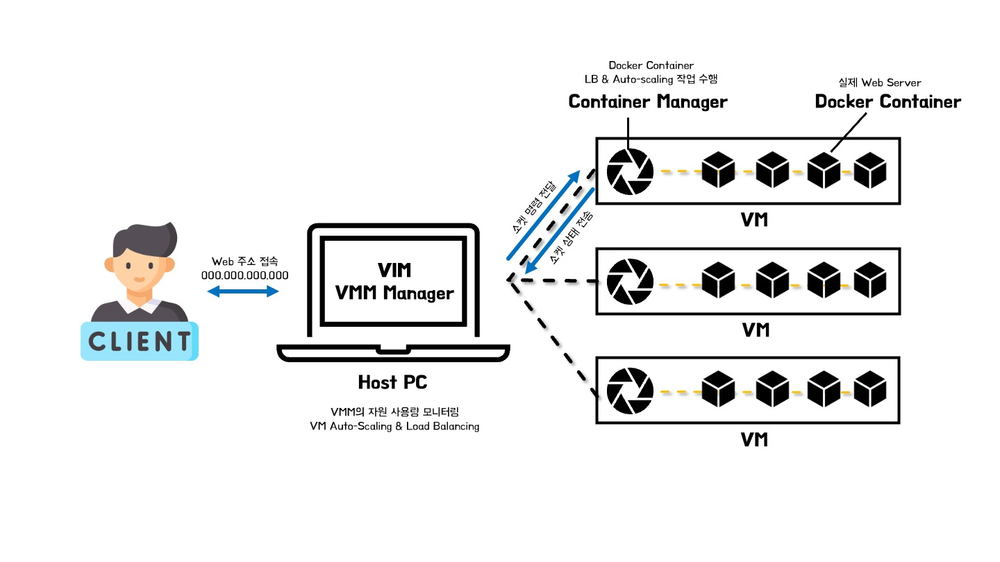

# Auto Cloud Sclaer

---

## 프로젝트 멤버 이름 및 멤버 별 담당한 파트 소개

| Member | 최정혜 | 나상진 | 김범모 | 김윤하 |
| --- | --- | --- | --- | --- |
| **Profile** | 
 [https://github.com/jeonghye-choi](https://github.com/jeonghye-choi)
 | 
 [https://github.com/Ns-Jin](https://github.com/Ns-Jin)
 | 
 [https://github.com/BeomMoKim](https://github.com/BeomMoKim)
 | 
 [https://github.com/xdbsgk](https://github.com/xdbsgk)
 |
| **담당 파트** | VIM의 Reverse Proxy 및 LoadBalancer 구현 | VIM과 VMM 간 소켓 연결 및 자원 사용량 메시지 송수신 구현 | 웹 서버 도커 컨테이너 생성 및 부하 로직 구현 | VMM 내 자원 사용량 모니터링 및 Auto-Scaling 기능 구현 |

## 프로젝트 소개

이 프로젝트는 가상 서버의 운영과 관리에 대한 이해를 높이기 위해 Virtual Machine Monitor(VMM)과 Docker 컨테이너를 활용한 Load Balancing 및 Auto-scaling 기능을 중점적으로 다룹니다. Virtual Infrastructure Manager(VIM)은 호스트 PC로서 VMM에 대한 Load Balancing 및 Auto-scaling을 담당하고, VMM은 가상 머신 내의 Docker Container에 대한 이러한 기능을 수행합니다. 이를 통해 가상 서버의 운영 및 관리 방법에 대한 깊은 이해를 제공합니다.

### 1. Virtual Infrastructure Manager (VIM)

- VIM은 Virtual Machine Monitor (VMM)에 대한 Load Balancing 및 Auto-scaling 기능을 수행합니다.
- 각 VM은 VIM에서 하나의 물리적인 호스트로 취급됩니다.
- VIM이 수행하는 역할은 다음과 같습니다:
    - **Load Balancer (LB)**: 여러 VM을 클러스터링하여 관리하며, 실제 동작 원리를 이해하기 위해 세부적인 동작을 직접 구현합니다.
    - **Auto-scaling**: Active 중인 VM의 도커 사용량을 확인하고 필요에 따라 스케일링을 진행합니다. 어느 VM에 도커 컨테이너를 증가시켜 할당할 것인지 결정하는 로직도 고려됩니다.

### 2. Virtual Machine Monitor (VMM)

- VMM은 Docker Container에 대한 Load Balancing 및 Auto-scaling 기능을 수행합니다.
- 각 VMM은 최대 컨테이너 수용 가능 갯수를 가지며, 웹 서버 도커 컨테이너를 만들 일종의 물리적인 하드웨어 자원으로 취급됩니다.
- 웹 서버 구현 시, 클라이언트가 접속하면 CPU에 부하를 줄 수 있는 간단한 로직을 포함합니다. 예를 들어, 사용자 한 명 당 컨테이너에 할당된 CPU 자원의 절반 정도를 사용하도록 설정할 수 있습니다.

## 프로젝트 필요성 소개

현대의 IT 인프라는 가상화 기술을 기반으로 운영됩니다. 이에 따라 클라우드 환경에서의 자동화된 운영 및 관리는 매우 중요합니다. 이 프로젝트는 실제 환경에서 발생할 수 있는 문제를 예측하고 대응할 수 있는 모니터링 시스템을 개발하여 클라우드 환경의 안정성과 효율성을 향상시키는 데 도움을 줄 것입니다.

## 관련 기술/논문/특허 조사 내용 소개

### **클라우드 서비스 제공업체의 Load Balancer 및 Auto-scaling 기능**

- **AWS(Amazon Web Services):** Elastic Load Balancing과 Auto Scaling 기능을 제공합니다.
- **Google Cloud Platform:** HTTP(S) Load Balancing과 Autoscaler를 통해 부하 분산 및 자동 확장 기능을 제공합니다.
- **Microsoft Azure:** Azure Load Balancer와 Autoscale을 통해 부하 분산 및 자동 크기 조정 기능을 제공합니다.

### **오픈 소스 Load Balancer 및 Auto-scaling 도구**

- **Kubernetes (K8s):** 컨테이너 오케스트레이션 플랫폼으로서, 내장된 기능 중 하나로 로드 밸런싱과 오토 스케일링을 지원합니다.
- **Docker Swarm:** Docker 원격 API를 기반으로 한 로드 밸런싱 및 자동 확장 기능을 제공합니다.
- **NGINX:** Reverse Proxy와 Load Balancer로 사용되며, NGINX Plus 버전에서는 더 많은 로드 밸런싱 기능을 제공합니다.

## 프로젝트 개발 결과물 소개

프로젝트의 핵심 기능은 VIM과 VMM 간의 협력적인 작업으로 이루어집니다. VIM은 VM을 관리하고, VMM은 도커 컨테이너를 관리합니다. 다음은 개발 결과물의 주요 기능을 설명한 다이어그램입니다.

## 개발 결과물을 사용하는 방법 소개 (설치 방법, 동작 방법 등)

## 개발 결과물의 활용방안 소개

이 시스템은 클라우드 환경에서의 안정성과 효율성을 극대화하여 다양한 비즈니스 요구에 대응할 수 있는 유연한 솔루션을 제공합니다.

- **웹 애플리케이션의 트래픽이 급증할 때**: Load Balancer가 트래픽을 여러 서버로 분산시켜 성능을 최적화합니다.
- **서버의 부하가 급격히 증가할 때**: Auto-Scaling 기능이 서버 리소스를 자동으로 확장하여 부하를 분산시킵니다.
- **클라우드 자원의 효율적인 관리**: 스케일링을 통해 자원을 최적화하여 비용 절감과 효율성을 극대화합니다.
- **가상 인프라 관리의 자동화**: VIM과 VMM의 협업으로 가상 머신과 도커 컨테이너의 상태를 실시간으로 모니터링하고, 필요에 따라 자동으로 조정합니다.
